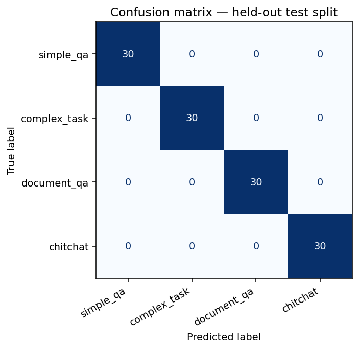

# agent-router

Multi-agent system whose routing layer is a **DistilBERT classifier I fine-tuned**, instead of paying tokens to a frontier LLM to route each request.

**Live demo:**

| | URL |
|---|---|
| Frontend (React + TS, Vercel) | https://agent-router-five.vercel.app |
| Backend API (FastAPI, Cloud Run) | https://agent-router-909428365094.us-central1.run.app |
| Model release tarball | https://github.com/raulmn00/agent-router/releases/tag/v0.1.0 |

The frontend has two modes: **Roteamento** (calls `POST /route` and renders the dispatched intent + agent trace) and **Comparação** (calls `POST /compare` and renders DistilBERT vs LLM zero-shot vs Embeddings+LogReg side by side with measured latency and cost). The DistilBERT model is fetched on cold start by the Cloud Run container from the GitHub Release above.

Showcases, in one repo:

- **Own fine-tuning** of `distilbert-base-uncased` on a synthetic dataset for 4 intent classes (`simple_qa`, `complex_task`, `document_qa`, `chitchat`).
- **Multi-agent orchestration** (Planner / Executor / Critic) built by hand on top of a pluggable `LLMProvider` (OpenAI / Anthropic / Fake).
- **FastAPI backend** with two endpoints: `POST /route` (one input → dispatched answer + agent trace) and `POST /compare` (one input → all three routers side-by-side with measured latency, confidence, and cost). Rate-limited via slowapi.
- **React + TypeScript frontend** that consumes both endpoints with a side-by-side comparison view whose column reveal is timed by the *measured* latency.
- **Comparative evaluation** of three router strategies: the fine-tuned model, an LLM zero-shot baseline, and an embeddings + LogisticRegression baseline — measured for accuracy, F1, latency, and cost on a held-out testset.

## Architecture

```
                       ┌─────────────────────────────┐
                       │      POST /route            │
                       │   { "input": "user text" }  │
                       └──────────────┬──────────────┘
                                      │
                                      ▼
                       ┌─────────────────────────────┐
                       │  DistilBERT intent router   │   <— fine-tuned
                       │   classify() -> intent      │       (this repo)
                       └──────────────┬──────────────┘
                                      │
        ┌─────────────────┬───────────┴──────────┬───────────────────┐
        ▼                 ▼                      ▼                   ▼
  simple_qa          complex_task           document_qa         chitchat
        │                 │                      │                   │
        ▼                 ▼                      ▼                   ▼
  1 direct call    Orchestrator              RAG stub            1 direct call
  to OpenAI        ┌─────────────┐           (integration        to OpenAI
  (gpt-4o-mini)    │  Planner    │            point for          (short max_tokens,
                   │     ↓       │            retriever)          warm/social tone)
                   │  Executors  │
                   │     ↓       │
                   │   Critic    │ — re-plans once if rejected
                   └─────────────┘
        │                 │                      │                   │
        └─────────────────┴──────────┬───────────┴───────────────────┘
                                     ▼
                       ┌─────────────────────────────┐
                       │      RouteResponse          │
                       │  {intent, confidence,       │
                       │   answer, path_taken,       │
                       │   trace}                    │
                       └─────────────────────────────┘
```

## Why these choices

| Choice | Why | Trade-off accepted |
|---|---|---|
| **DistilBERT local** instead of LLM-as-router | Routing is on the hot path of every request; paying an LLM call just to pick a branch is wasteful. Local inference removes that hop entirely once the model is trained. | Need to train + version + ship a 256 MB binary. |
| **Hand-rolled multi-agent loop** (no LangChain / CrewAI / etc.) | The whole point of the demo is to show I understand what an agent loop is and what `Planner → Executor → Critic → retry` looks like in plain code. Frameworks hide exactly the part the reader needs to see. | Less abstraction reuse if I later want fan-out / async tools / state machines. |
| **`LLMProvider` ABC** with OpenAI / Anthropic / Fake impls | Tests run with `FakeProvider` (no network, no spend). Production can pick the provider via env var. Both real providers go through the same call surface. | One extra layer to maintain. |
| **Synthetic dataset of 600 templated examples** for fine-tuning | A held-out, handcrafted testset of 40 lives in `eval/` and is what gets reported. The synthetic 600 is just enough signal for DistilBERT to separate the 4 classes; bigger gains would come from real labelled data. | F1 on the template-distribution test split is artificially high (the test split shares templates with training). The honest number is the one in the evaluation table below, against the handcrafted held-out set. |
| **Pure-function metrics** (`accuracy`, `f1_macro`, `cost_per_1k`) | Testable without network or training. Pricing is a documented constant — comparison stays auditable. | Cost is a function of declared token assumptions, not measured token counts. Replace with measured counts if you want a precise number. |

## How to run

### Prerequisites
- Python 3.12+ (tested on 3.13 too — the pyproject pin is conservative)
- `OPENAI_API_KEY` in `.env` (copy from `.env.example`) — required for the backend and for the eval baselines
- ML stack: `pip install -r backend/requirements.txt` (or install the per-package extras you need)

### 1. Tests (no network, no spend)

```bash
python -m pytest
```

### 2. Train the DistilBERT router

```bash
cd router
python -m router.train
```

Saves model + tokenizer to `router/model/`. Device auto-detected (CUDA → MPS → CPU). The training dataset is committed at `router/data/intents.jsonl` (regenerate with `python -m router.dataset` if you change the templates).

### 3. Fit the embeddings LogReg (one-time)

```bash
cd eval
python -m eval.fit_embed_router
```

Writes `eval/models/embed_router.joblib` (~25 KB, committed in this repo). Required by `POST /compare`'s embed-router row; if missing, that row just carries an error and the other two routers still respond.

### 4. Run the backend

```bash
cd backend
uvicorn app.api:app --reload --port 8000
```

Endpoints: `GET /` (health), `POST /route` (single dispatch, 30 req/min/IP), `POST /compare` (three-way comparison, 10 req/min/IP — burns real tokens, hence the tighter limit). CORS is open by default; set `CORS_ALLOW_ORIGINS` env var to restrict.

### 5. Frontend (optional)

```bash
cd frontend
cp .env.example .env       # default VITE_API_URL=http://localhost:8000
npm install
npm run dev                # http://localhost:5173
```

### 6. Compare the three routers offline (no backend)

```bash
cd eval
python -m eval.compare_routers --runs 3
```

Generates `eval/results/comparison.md` and `comparison.csv`. The `--runs N` flag aggregates N independent runs, clearing the embedding cache between them so the embed router stays cold-cache (production-like) for every measurement. Reuses the same code that powers `POST /compare`.

## Evaluation & honest analysis

Two views into the model: the held-out **test split** (a perfect score that tells you less than it looks) and a **generalization probe** against inputs from outside the training distribution (much more informative).

### 1. Held-out test split — 120 examples, 30 per class

Trained on Google Colab (CUDA, fp16, `distilbert-base-uncased`, 4 epochs, batch 16, lr 5e-5, weight_decay 0.01, max_length 64) over the 480/120 train/test split from `router/data/intents.jsonl`. Every row of the confusion matrix lands on the diagonal — zero misclassifications.



```
              precision    recall  f1-score   support

   simple_qa     1.0000    1.0000    1.0000        30
complex_task     1.0000    1.0000    1.0000        30
 document_qa     1.0000    1.0000    1.0000        30
    chitchat     1.0000    1.0000    1.0000        30

    accuracy                         1.0000       120
   macro avg     1.0000    1.0000    1.0000       120
weighted avg     1.0000    1.0000    1.0000       120
```

Versioned evidence in [`router/results/`](router/results/):
[`confusion_matrix.png`](router/results/confusion_matrix.png) · [`confusion_matrix.csv`](router/results/confusion_matrix.csv) · [`classification_report.json`](router/results/classification_report.json) · [`classification_report.txt`](router/results/classification_report.txt) · [`training_meta.json`](router/results/training_meta.json) · [`generalization_test.txt`](router/results/generalization_test.txt).

**Reading the 100% honestly.** This is not a flex. The training set is *synthetic* — every example was generated from the template bank in `router/router/dataset.py`, and the test split is sampled from the same template distribution as training (disjoint sentences, but shared per-class markers). With four classes and consistent surface cues, a fine-tuned DistilBERT separates them trivially. The perfect score says **the task is easily separable on this dataset**, not that the model is exceptional. The number that actually matters is what happens off-distribution — section 2 below.

### 2. Generalization probe — inputs from outside the training distribution

I wrote 20 fresh sentences (different topics and phrasings, never seen at training time) and ran `IntentClassifier.classify()` on each. Full output committed at [`router/results/generalization_test.txt`](router/results/generalization_test.txt).

**16 sentences with obvious class markers** (different from the training templates, but a human would still know the intent):

```
simple_qa     0.857  What's the capital of Australia?
simple_qa     0.847  How many milliliters are in a cup?
simple_qa     0.849  Who wrote the novel Dom Casmurro?
simple_qa     0.851  What year did the Berlin Wall fall?
complex_task  0.939  Design a scalable architecture for a food delivery app...
complex_task  0.825  Plan a 7-day trip to Japan...
complex_task  0.910  Help me migrate a monolith to microservices step by step.
complex_task  0.930  Create a go-to-market strategy for a B2B SaaS...
document_qa   0.871  According to the attached contract...
document_qa   0.879  In the PDF I uploaded, which section covers the refund policy?
document_qa   0.813  Summarize the key findings from this research paper.
document_qa   0.880  Based on the document, what are the eligibility requirements?
chitchat      0.542  Hey, how's it going today?
chitchat      0.560  Good morning! Hope you're having a nice day.
chitchat      0.518  Haha that's pretty funny.
chitchat      0.562  Thanks so much, you've been really helpful!
```

All 16 classified correctly. Confidence sits around **0.81–0.94** for the first three intents — and notably **0.52–0.56** for `chitchat`, meaningfully lower even when the answer is right.

**4 ambiguous sentences crafted to remove obvious markers:**

```
chitchat      0.385  Tell me about the requirements
chitchat      0.510  Build me something cool
simple_qa     0.588  What does it say about pricing?
chitchat      0.417  Can you explain how this works?
```

These are deliberately underspecified — without surrounding context a human reader could argue for two or three classes for each. Confidence drops to **0.39–0.59**.

**What this actually tells me:**

- **Calibration is decent.** The model doesn't crank every prediction up to 0.99. Confidence visibly drops on inputs it should be unsure about. That's the property that matters for a routing layer — a route picked at 0.42 should be treated very differently from one picked at 0.92.
- **`chitchat` is doing double duty.** It's both a legitimate intent ("hey, thanks!") AND the soft fallback the model lands on when nothing else fits — 3 out of 4 ambiguous probes ended up there with low confidence. The boundary between *real* chitchat and *I don't really know* is the fuzziest one in the model, which is also why even legitimate chitchat tops out around 0.56.
- **A confidence threshold is empirically justified — and now implemented.** A `~0.65` floor cleanly separates the 16 clear inputs (lowest 0.813) from the 4 ambiguous ones (highest 0.588). The dispatcher now gates routing on this exact threshold: predictions with `confidence < CONFIDENCE_THRESHOLD` (default `0.65`, env-configurable) skip the normal dispatch arms and land on a cheap `low_confidence_fallback` path that returns an honest "I'm not sure" response — same `RouteResponse` schema, `path_taken = "low_confidence_fallback"`, `trace` records the intent that *would* have been chosen and the measured confidence. No LLM call on the fallback path; an LLM-driven clarifying-question step is the next natural extension. See [`backend/app/dispatch.py`](backend/app/dispatch.py) (`Dispatcher._low_confidence_fallback`).

### 3. Comparison against baselines — to be measured

Run locally with the trained model in place; the script writes its output to `eval/results/comparison.{md,csv}` and the README table below should be re-filled from it.

```bash
cd eval && python -m eval.compare_routers --runs 3
```

| Approach | Accuracy | F1 (macro) | Mean latency (ms) ± stdev | Cost / 1k (USD) | N |
|---|---:|---:|---:|---:|---:|
| **DistilBERT (fine-tuned)**   | _a preencher com `python -m eval.compare_routers`_ | _idem_ | _idem_ | _idem_ | _idem_ |
| LLM zero-shot (gpt-4o-mini)   | _a preencher com `python -m eval.compare_routers`_ | _idem_ | _idem_ | _idem_ | _idem_ |
| Embeddings + LogReg           | _a preencher com `python -m eval.compare_routers`_ | _idem_ | _idem_ | _idem_ | _idem_ |

Cost values come from the documented assumptions in `eval/eval/metrics.py` (`PRICING_USD_PER_M_TOKENS`, `TOKEN_ASSUMPTIONS`), not from measured per-call token counts.

### When each approach makes sense

- **DistilBERT (fine-tuned)** wins when the set of intents is closed and stable, you have (or can synthesize) training data, and the router is on the hot path. Local inference removes the round-trip to an LLM API entirely, and the cost per request drops to local compute only. The trade-off is that you carry a trained model artifact and have to retrain when intents change.

- **LLM zero-shot** wins when intents change every week, you don't yet have labelled data, or traffic is low enough that token cost doesn't matter. It's the right baseline for an MVP — and the cheapest way to bootstrap the labelled set that the DistilBERT path needs later.

- **Embeddings + LogReg** sits in between. You need some labelled data but don't want to fine-tune a model end-to-end. Adding a class is fast (re-fit the LogReg in seconds). Whether this beats the LLM zero-shot in your setup depends on the embedding model's discriminative power for your specific intent set — measure both before committing.

## Project layout

```
agent-router/
├── router/         # DistilBERT intent classifier — train + classify
├── agents/         # Planner / Executor / Critic / Orchestrator + LLMProvider
├── backend/        # FastAPI: /route + /compare + slowapi rate limiting
├── eval/           # Comparative evaluation (DistilBERT vs LLM vs embed)
├── frontend/       # React + TS demo UI (Vite, hand-written CSS)
├── pyproject.toml  # Workspace root (pytest config)
└── .env.example    # API keys + optional overrides
```

Each subpackage has its own `pyproject.toml` (or `package.json`) and `README.md`:

- [router/README.md](router/README.md)
- [agents/README.md](agents/README.md)
- [backend/README.md](backend/README.md)
- [eval/README.md](eval/README.md)
- [frontend/README.md](frontend/README.md)

## Deployment (Google Cloud Run)

The model artifact is 256 MB and is **not committed to git**. The Docker image fetches it at container start from a configured URL (e.g. a GitHub Release tarball). See `backend/Dockerfile` and `backend/entrypoint.sh` for the wiring, and `backend/README.md` for the exact `gcloud run deploy` command.

Key flags:
- `--memory 1Gi` (model load + working set fit comfortably here)
- `--cpu 2` (DistilBERT inference is single-threaded; 2 vCPUs leaves headroom for the LLM dispatch path's I/O)
- `--min-instances 0` is fine; cold start pays one model load (the lazy classifier in `backend/app/api.py` defers that until the first `/route` request).

## Testing

```
router/tests/    schema, balance, stratified split, classifier softmax/argmax              (11)
agents/tests/    orchestrator happy path + critic-reproves-and-retries                    (15)
backend/tests/   /route + /compare + 413/422/429/503/500 + security headers + sanitization (22)
eval/tests/      accuracy, f1_macro, cost_per_1k pinning                                   (17)
```

**65 backend tests** (`python -m pytest`); runs without GPU and without spending API credits. Heavy ML deps are skipif-gated so schema and orchestration tests still run in environments that don't have `torch`/`transformers` installed. Frontend's `npm run build` runs `tsc -b` first — type-check failures break the build.

## Security posture (v0.2.1)

| Layer | Mitigation |
|---|---|
| Cloud Run runtime | Dedicated SA `agent-router-runtime@…` with `roles/secretmanager.secretAccessor` on `openai-api-key` only — no project-level Editor. |
| Container | Runs as non-root `app` (UID 1000); `/app` is the only writable path. |
| Transport | Cloud Run + Vercel enforce TLS. Backend sets HSTS (`max-age=31536000`), nosniff, `X-Frame-Options: DENY`, no-referrer, `Cross-Origin-Resource-Policy: same-site`. |
| CORS | `CORS_ALLOW_ORIGINS` allowlist (no wildcard in production). Combination `*` + `allow_credentials` is auto-corrected (credentials disabled) instead of silently broken. |
| Rate limiting | slowapi: 30 req/min/IP on `/route`, 10 req/min/IP on `/compare`. |
| Request size | Hard cap at `MAX_BODY_BYTES` (default 10 000) before Pydantic. 413 returned on oversize. |
| Error surface | 503 generic ("upstream LLM provider is not configured"). 500 opaque. `/compare` per-row errors drawn from a fixed safe allowlist — never echoes raw exception text. |
| Secrets | `.env` gitignored; production reads `OPENAI_API_KEY` from Secret Manager via Cloud Run's secret mount. |
| API surface | `/docs`, `/redoc`, `/openapi.json` return 404 when `ENABLE_API_DOCS=false`. |
| Dependencies | `npm audit` clean (vite 8 + plugin-react 6). Python deps pinned in `backend/requirements.txt`. |
